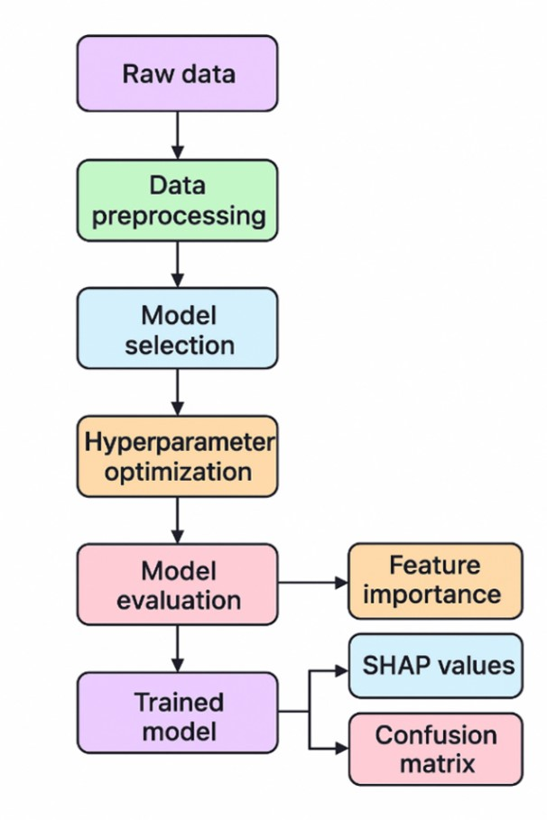
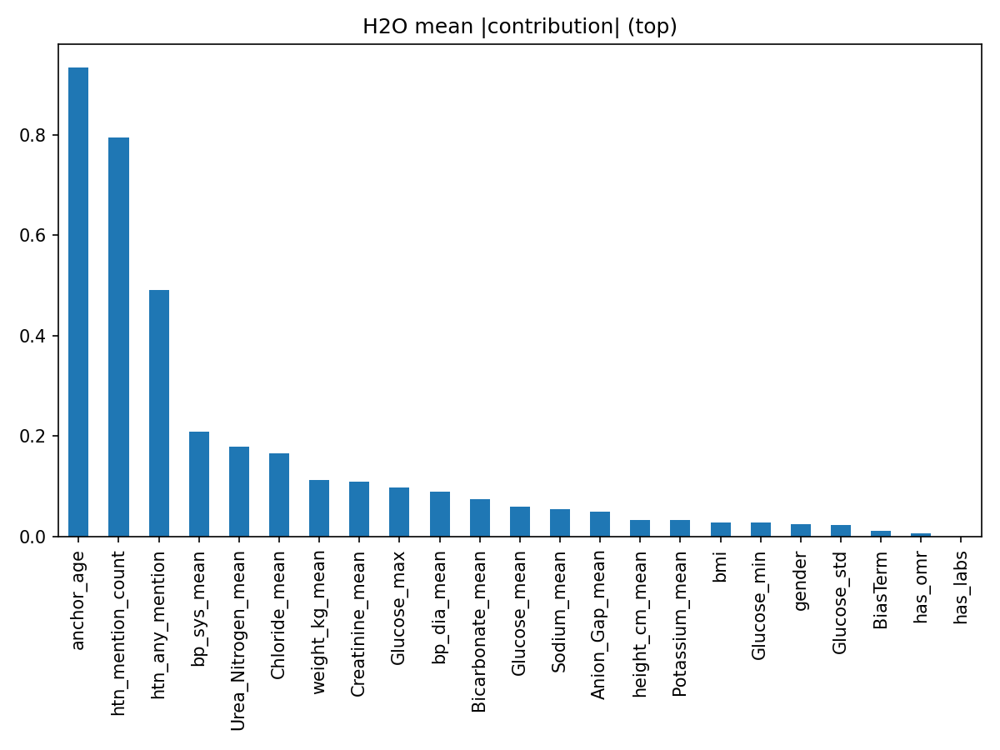

# Multimodal AutoML for Clinical Phenotyping (Hypertension)  
**AutoGluon · H2O AutoML · FLAML** — Feature engineering from MIMIC-IV (structured + discharge & radiology notes), model benchmarking, and explainability (SHAP)

---

## 🔎 Project summary
This repository contains a reproducible pipeline and experimental study that evaluates **AutoML frameworks** for clinical phenotyping (hypertension) using the MIMIC-IV dataset. The pipeline integrates structured (labs, vitals, demographics) and unstructured (discharge and radiology notes) data, produces engineered features (including rule-based NLP phenotype features), trains multiple AutoML and baseline models, and provides interpretability artifacts (feature importance, SHAP).

**The goal** is to assess whether off-the-shelf AutoML systems (AutoGluon, H2O AutoML, FLAML) can produce robust, interpretable classifiers on real clinical data and how they compare against tuned baseline models (XGBoost, LightGBM, Random Forest, Logistic Regression).

---

## 🧠 Pipeline Architecture
The overall system architecture illustrates data extraction, feature engineering, AutoML training, and explainability.



---

## 🗂️ Data Sources
- **MIMIC-IV v2.2**
- Structured tables: `patients`, `labevents`, `omr`, `chartevents`
- Clinical notes: `discharge`, `radiology`
- Target label: Hypertension (ICD-9/10 based definition)

---

## 🧪 Feature Engineering

### Structured Features
Extracted statistical summaries from labs, vitals, and anthropometric measurements.

📄 **Feature descriptions:**  
[reports/tablesfeature_descriptions](reports/tables/features_disc.csv)

### Feature Distributions
Visual inspection of feature distributions after preprocessing.

<table>
  <tr>
    <td></td>
    <td></td>
  </tr>
  <tr>
    <td></td>
    <td></td>
  </tr>
  <tr>
    <td></td>
    <td></td>
  </tr>
  <tr>
    <td></td>
    <td></td>
  </tr>
  <tr>
    <td></td>
    <td></td>
  </tr>
  <tr>
    <td></td>
    <td></td>
  </tr>
  <tr>
    <td></td>
    <td></td>
  </tr>
</table>

### Feature Correlations
Correlation structure among engineered features.


---

## 📝 NLP-based Clinical Phenotyping
Hypertension mentions were extracted from discharge summaries and radiology reports using:

- Rule-based keyword matching
- Negation detection with contextual windows
- LLM-assisted ambiguity resolution

Temporal validation ensured **no label leakage** from post-discharge documentation. (you can check: reports/tables/notes_timing_leakage_summary.csv)

---

## 🔎 Model Explainability

### Feature Importance
Global feature importance for top-performing models.

<table>
  <tr>
    <td></td>
    <td></td>
  </tr>
  <tr>
    <td></td>
  </tr>
</table>

### SHAP Analysis (AutoGluon)
SHAP summary plot highlighting both magnitude and direction of feature effects.


**Key insight:**  
Age, hypertension mentions in clinical notes, systolic blood pressure, and electrolyte biomarkers consistently drive predictions, aligning with established clinical knowledge.

---

## ⚡ Quick results (test set — **Final Hospital + Phenotypes**)
> Models were trained & evaluated on the same final test split. AutoGluon and tree-boosted models achieved the highest AUCs. Reporting key metrics (ROC-AUC, Accuracy, F1, Precision, Recall, MCC, Training Time).

| Model | ROC AUC | Accuracy | F1 | Precision | Recall | MCC | Training Time |
|---|---:|---:|---:|---:|---:|---:|---:|
| **AutoGluon** | **0.9284** | **0.8476** | **0.8479** | 0.8479 | 0.8479 | **0.6953** | 180 s |
| H2O AutoML | 0.9261 | 0.8426 | 0.8462 | 0.8288 | **0.8644** | 0.6859 | 600 s |
| FLAML | 0.9159 | 0.8283 | 0.8291 | 0.8266 | 0.8317 | 0.6566 | 600 s |
| LightGBM | 0.9276 | 0.8432 | 0.8433 | 0.8441 | 0.8425 | 0.6864 | ~57 s |
| XGBoost | 0.9274 | 0.8451 | 0.8454 | 0.8451 | 0.8458 | 0.6902 | ~11 s |
| Logistic Regression | 0.9121 | 0.8258 | 0.8238 | 0.8351 | 0.8128 | 0.6520 | ~44 s |
| Random Forest | 0.9226 | 0.8387 | 0.8386 | 0.8409 | 0.8363 | 0.6775 | ~241 s |

> Figures: `./figures/roc_*` and `./figures/confusion_matrix_*` contain the ROC and confusion matrix images used in the paper.

---

## Duplicating the .env File
To set up your environment variables, you need to duplicate the `.env.example` file and rename it to `.env`. You can do this manually or using the following terminal command:

```bash
cp .env.example .env # Linux, macOS, Git Bash, WSL
copy .env.example .env # Windows Command Prompt
```

This command creates a copy of `.env.example` and names it `.env`, allowing you to configure your environment variables specific to your setup.


## Project Organization

```
├── LICENSE            <- Open-source license if one is chosen
├── README.md          <- The top-level README for developers using this project
├── data
│   ├── external       <- Data from third party sources
│   ├── interim        <- Intermediate data that has been transformed
│   ├── processed      <- The final, canonical data sets for modeling
│   └── raw            <- The original, immutable data dump
│
├── models             <- Trained and serialized models, model predictions, or model summaries
│
├── notebooks          <- Jupyter notebooks. Naming convention is a number (for ordering),
│                         the creator's initials, and a short `-` delimited description, e.g.
│                         `1.0-jqp-initial-data-exploration`
│
├── references         <- Data dictionaries, manuals, and all other explanatory materials
│
├── reports            <- Generated analysis as HTML, PDF, LaTeX, etc.
│   ├── figures        <- Generated graphics and figures to be used in reporting
│   └── tables         <- Generated tables of analysis and resluts to be used in reporting
│
├── requirements.txt   <- The requirements file for reproducing the analysis environment, e.g.
│                         generated with `pip freeze > requirements.txt`
│
└── src                         <- Source code for this project
    │
    ├── __init__.py             <- Makes src a Python module
    │
    ├── config.py               <- Store useful variables and configuration
    │
    ├── dataset.py              <- Scripts to download or generate data
    │
    ├── features.py             <- Code to create features for modeling
    │
    │    
    ├── modeling                
    │   ├── __init__.py 
    │   ├── predict.py          <- Code to run model inference with trained models          
    │   └── train.py            <- Code to train models
    │
    ├── plots.py                <- Code to create visualizations 
    │
    └── services                <- Service classes to connect with external platforms, tools, or APIs
        └── __init__.py 
```

--------
